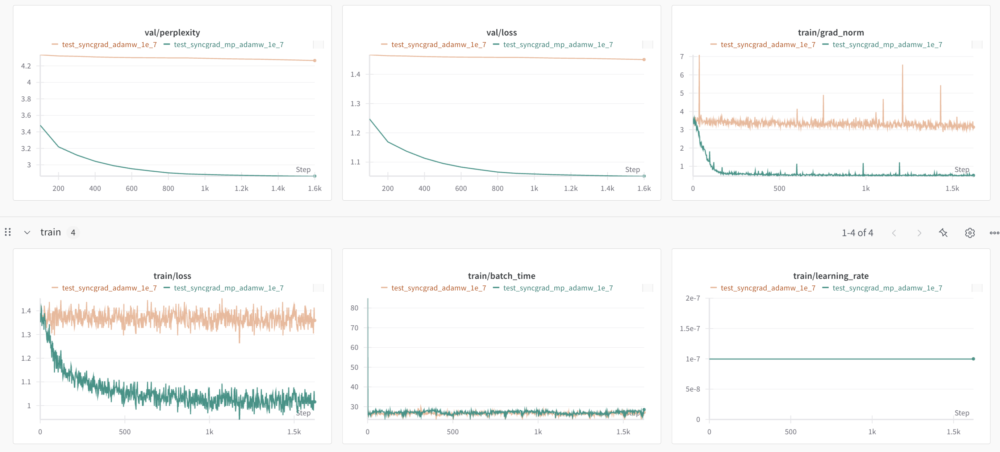
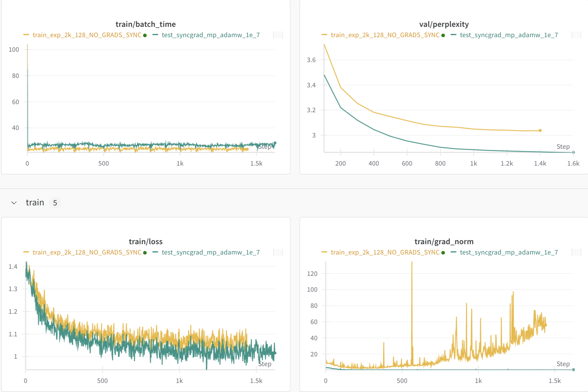
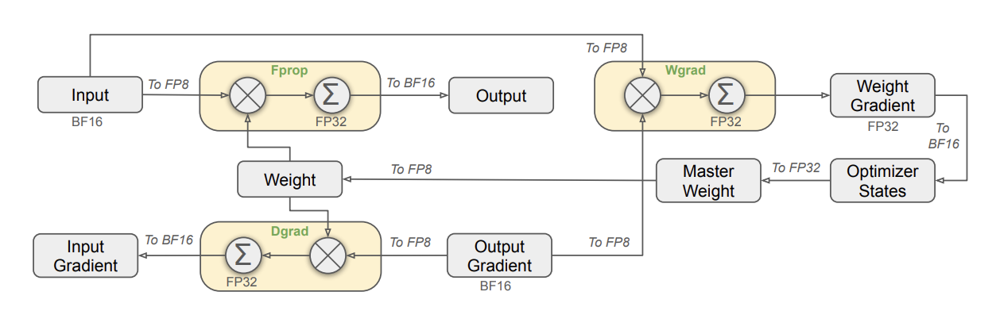
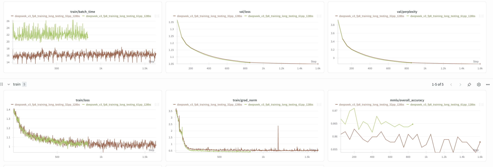

# Pipelining-SFT

**Contributors**: [Chetwin Low](https://www.linkedin.com/in/chetwin-low-061975193) [Weimin Wang](https://www.linkedin.com/in/weimin-wang-will)


A simple yet efficient full-parameter SFT framework for large-scale LLMs with MoE, supporting pipeline parallelism, expert parallelism, and tensor parallelism. This started as an experimental project—with more features coming soon—and welcomes collaboration. It is also suitable for production-scale SFT workloads.

This repository provides an end-to-end fine-tuning framework, using DeepSeek V3 as a reference implementation.

---

## 🚀 Highlights

- **Sharding**:  
  - Pipeline parallelism across nodes  
  - Expert and tensor parallelism across 8 ranks within each node

- **HuggingFace Integration**:  
  - Launch from official HuggingFace model weight directories  
  - Export back to HuggingFace checkpoint format (on GCS)

- **Mixed Precision AdamW**:  
  - Custom `mp_adamw.py` for BF16 training with FP32 master weights

- **FP8 Mixed Precision Training (Experimental)**
  - Leveraging [DeepGEMM](https://github.com/deepseek-ai/DeepGEMM) for fp8 linear layers, with custom triton kernels

- **Training Stability**:  
  - Gradient synchronization in MLA and MoE layers to prevent divergence

- **Checkpointing**:
  - BF16 checkpoint: 1.3 TB  
  - FP32 → FP8 block-quantized checkpoint: 630 GB  

- **Torch Modifications**:  
  - `torch_pipelining` contains modified files from `torch.distributed.pipelining` to support dynamic batch sizes, reduced memory bubbles, etc. 

---
## Hardware Configuration
This training framework was built with the following per-node hardware configurations. Our training cluster leverages GPUDirect-TCPX for high-speed internode communication. 

| Component  | Specification/Version       | Command to View Details  |  
|------------|-----------------------------|--------------------------| 
| GPU        | 8 x NVIDIA H100 80GB HBM3   | `nvidia-smi`             |   
| CPU        | Intel(R) Xeon(R) Platinum 8481C (96 Cores) | `lscpu` |    
| Memory     | 1.0TB DDR4                  | `free -h`                | 
| Storage    | 40TB NVMe SSD              | `df -h`                  |
| OS         | Ubuntu 22.04                | `uname -a`               | 
| CUDA       | CUDA 12.4                   | `nvcc -V`                | 
---

## Installation

### 1. Clone the repo & set up the environment:

```bash
git clone https://github.com/character-ai/pipelining-sft.git

conda create -n simple-pp python=3.11 -y
conda activate simple-pp

pip install -r requirements.txt
pip install torch==2.6.0 torchvision==0.21.0 torchaudio==2.6.0 --index-url https://download.pytorch.org/whl/cu126
pip install flash_attn==2.8.1 

# install DeepGEMM
git clone --recursive git@github.com:deepseek-ai/DeepGEMM.git
cd DeepGEMM
# important - we implemented FP8 Training based on an older version of DeepGEMM, before a very recent non-trivial restructure of DeepGEMM
git checkout 03d0be3d2d03b6eed3c99d683c0620949a13a826

python setup.py install

```

---

## ⚡ Quick Start
1. 📥 Download the Model and Tokenizer
Before training, you need to download the pretrained model and tokenizer from Hugging Face into a local cache directory.

```bash 
cd pipelining-sft  # Navigate to project directory

python3 download_model.py \
  --model_id "deepseek-ai/DeepSeek-V3-0324" \
  --cache_dir "/home/<user>/hf_cache"
```

✅ After the download completes, the script will print a message like:

```bash
📦 Model snapshot directory: /home/<user>/hf_cache/models--.../snapshots/<hash>
```

✍️ Copy that path and set it as the value for `model.model_dir` in your training config file:
`configs/train.yaml`.


🧰 Alternative Option

Alternatively, you can manually download the model and tokenizer files from Hugging Face and place them into a directory that contains the full checkpoint and tokenizer. Then, in `configs/train.yaml`, set:

```bash
model:
  model_dir: /path/to/your/downloaded/checkpoint
```

Ensure the directory includes all required files (e.g., config.json, pytorch_model.bin, tokenizer.json, etc.).


2. 🚀 Launch Training
```bash
sbatch launch.sh
```

The `launch.sh` script sets up your machines and uses SLURM to launch your job across nodes on GCP. It uses **32 nodes** by default.

Training configuration is located in `configs/train.yaml` — please adjust according to your task.

Some explanations within `configs/train.yaml`: 

- model: 
  - `model.model_dir` - this is the directory where the pretrained model should be installed to
  - `model.fp8_training.enabled` - if True, will enable fp8 training (experimental) 

- checkpointing: 
  - `checkpoint.use_fp8_quantization` - whether to quantize the weights to fp8 during saving. Recommended to use only for fp8 training. 
  - `checkpoint.save_dir` - directory to save the checkpoints. 
    - It can be a local path to a **NFS** (e.g. '/data/...') or a **GCS** path (e.g. 'gs://...'). 
    - **GCS** path will be recommended for stable multiprocess writing. 
  - `checkpoint.local_output_dir` - local directory used for temporally saved checkpoints and files, before being copied to `save_dir`

- distributed: 
  - `distributed.num_microbatches` - number of microbatches for PP training. Should be multiples of `pp_size`
  - `distributed.pp_size` - total number of PP stages to use. Can be 32, or 61 (i.e. each DS layer is a PP stage)
  - `total_batch_size = micro_batch_size_on_each_pp_stage × total_stages`
  - Data parallelism is currently disabled (`dp_size`==1); may be added later

- dataset:
  - `dataset.name` - either name of dataset repository on the HF hub like [HuggingFaceH4/ultrachat_200k](https://huggingface.co/datasets/HuggingFaceH4/ultrachat_200k) or path of a local directory that is compatible with `load_dataset` from `datasets`.
  - We use a chat dataset "HuggingFaceH4/ultrachat_200k" that uses a [SimpleChatDataset](https://github.com/character-ai/pipelining-sft/blob/main/data.py#L9), if you want to use a custom dataset with custom formatter, please prepare it in an `datasets` compatible format and define a custom class or function for formatting if required. 

---

## 📚 Lessons Learned

### 1. Mixed Precision Training

We implemented a custom **Mixed Precision AdamW** (`mp_adamw.py`) that:
- Maintains FP32 master weights while fwd, bwd and gradients are kept in bf16 precision
- Introduces minimal memory overhead
- Keeps training speed nearly unchanged
- Enables stable convergence at very low learning rates where standard AdamW fails
- DeepSeek technical report demonstrates full precision master weights is required for loss convergence, and lower precision optimizer states is sufficient, which also saves a lot of GPU memory. We empirically validated this claim.
- However, native PyTorch Adam Optimizer forces optimizer states to be in same precision as parameter dtype, which incurs high GPU consumption, thus to support lower precision optimizer states with full precision master weights, we made small but vital changes to PyTorch's official AdamW implementation (Torch 2.6) 

#### 📈 Training Stability Comparison:



> Green = MPAdamW, Orange = BF16 AdamW  
> Under a small learning rate (`1e-7`), standard AdamW with BF16 fails to converge, while MPAdamW converges smoothly with minimal training slowdown and memory increase.

### 2. Gradient Synchronization for Stability

Added `grad_sync` functions in both **MLA** and **MoE** layers, helping to prevent training divergence across distributed ranks.

In our development of our multi-parallelism training framework, we noticed some interesting properties of Deepseek's MLA and MoEs trained with Expert Parallel, specifically related to gradient divergence in the backward if not handled precisely.

1. MLA: It uses shared learnable position embeddings (k_pe) across attention heads for K projections, which means that when Tensor-Parallel (TP) is enabled for attention, k_pe receives different gradients in the backward pass for different sets of attention heads and thus if we do not add backward hooks to sync gradients for k_pe, the gradients will start to diverge across replicated parameters within the TP group.

2. MoE: Most MoE forward implementations use indices masking to efficiently run experts on selected tokens and accumulate the results coupled with the corresponding expert weight in an output tensor. Due to the numerical accuracy issue of [PyTorch's matrix operations](https://docs.pytorch.org/docs/stable/notes/numerical_accuracy.html), there will be differences in gradients for replicated parameters within Expert Parallel group. Hence we require 2 explicit gradient hooks in the backward for a single MoE layer.

An alternative implementation would be to explicitly sync all replicated parameters within the TP and/or EP group at the end of the backward, but we chose to implement with grad_sync since it looks cleaner.



> Green = with grad_sync, Orange = not using grad_sync  
> without using grad_sync, training is becoming unstable with grad_norm exploding and loss curves a bit higher

### 3. FP8 Mixed Precision Training (Experimental)
One major issue with bf16 training is that serving becomes expensive. Just the model loading of a bf16 version of DeepSeek V3 requires 1.3Tb of GPU VRAMM, which requires multiple nodes for 1 instance, even with H200s. Considering that even the fastest internode communication is vastly slower than intranode communication, multi-node deployments are much more expensive than single node ones.

As such, we enable `use_fp8_quantization` to export our finetuned checkpoints in fp8 with DeepSeek's official block-wise quantization algorithm. However, we noticed that without proper Quantization Aware Training (QAT), naive export-time quantization severely negates the effects of the finetuning, i.e the changes in the model parameters largely revert back to the initial values. 

To solve the problem, We decided to implement the fp8 mixed precision training described in DeepSeek technical report.




To support fp8 training, we use [DeepGEMM](https://github.com/deepseek-ai/DeepGEMM), which does efficient fp8 matmuls and fp32 accumulations to migate loss in precision. However, since DeepGEMM only provides efficient 
kernels for the core matmul operation, while other aspects like quantizing activations and weights are not fused, which makes the entire fp8 linear layer very inefficient considering that these operations are relatively expensive. Naively, our custom fp8 linear class is roughly 10x slower than native pytorch bf16 linear class. We then implemented custom fused versions of these quanitization operations, and managed to get a 2-3x speed up, closing the gap between our fp8 custom linear and native pytorch's bf16 linear.



We can increase BS by increase total number of stages from 32 to 61 (there are 61 layers in DeepSeek V3). 

We noticed that the increase in batch time is from 16s to 22s, while reducing the total training iters to half. 

### 4. Training Speed (H100 with GPUDirect-TCPX* Benchmark) on 32 nodes

| Total Batch Size | Context Length | Iteration Time | GPU numbers 
|------------------|----------------|----------------|----------------|
| 128              | 2k             | 16s            | 32 x 8
| 64               | 4k             | 16s            | 32 x 8
| 244              | 2k             | 22s            | 61 x 8

*Slower than InfiniBand
